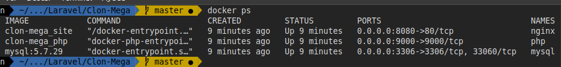
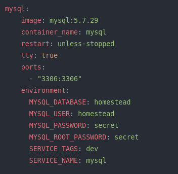

## Requirements

* Docker 20.0.0+
* Docker Compose 1.26.0+

## Install

To lift the entire project execute the command:

```
	docker-compose up -d --build site
```

Install Laravel dependencies using an ephemeral Composer container:

```
docker-compose run --rm composer update
```

The containers (Services) that docker-compose raises are:

* nginx  :8080
* mysql  :3306 
* php    :9000
* mailhog: 8025


## Development:

Install dependencies using an ephemeral Node container:

```
docker-compose run --rm npm install
```

Set to development mode:

```
docker-compose run npm run dev

docker-compose run npm run watch
```




Create a file for env variables

```
	cp src/.env.example src/.env
```
Create a key for Laravel

```
	docker-compose run --rm artisan key:generate
```

Additionally, Composer, NPM and Artisan can also be managed through Docker. To do this use the following commands:

* docker-compose run --rm composer update
* docker-compose run --rm npm run dev
* docker-compose run --rm artisan migrate

## NetWork

To facilitate communication between services, containers are connected to a network called **laravel**, this creates a higher level of security for applications and ensures that only related services can communicate with each other.


### MySQL volume
In production create a volume for mysql persistence, create a mysql folder at the height of src, nginx and php:

```
  mkdir ./mysql
```

And add the following line to the docker-compose.yml file:

```
volumes:
  - ./mysql:/var/lib/mysql
```

### Change MySQL credentials

Change the credentials shown in docker-compose.yml




## Credits

* Boilerplate: https://github.com/aschmelyun/docker-compose-laravel
* Laravel: https://github.com/laravel/laravel	
